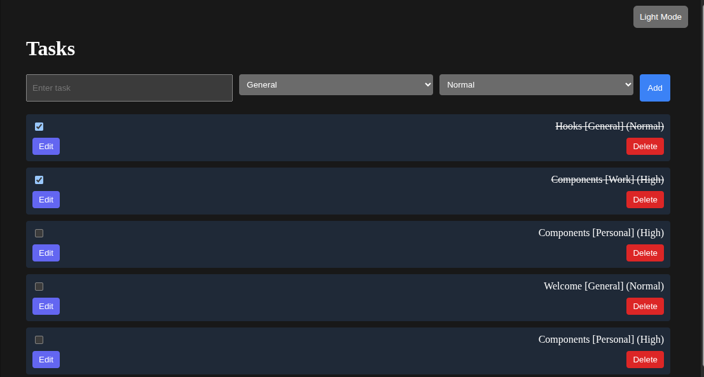
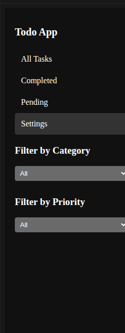
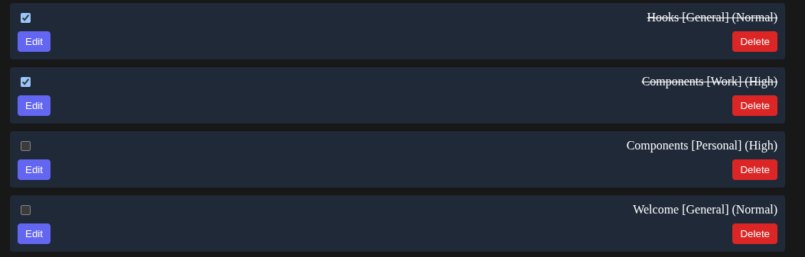

# React Todo App

## Overview
This is a fully functional React Todo App featuring:
- Add, Edit, Delete tasks
- Mark tasks as Completed / Pending
- Task Categories and Priority Levels
- Filter tasks by status, category, and priority
- Dark/Light theme toggle
- Collapsible sidebar for mobile
- Responsive design for desktop and mobile
- LocalStorage persistence

## Live Demo
You can view the app online:  
[Live URL](https://your-live-app-url.com)

## Screenshots
### Dashboard View


### Sidebar and Filters


### Edit Modal


> **Tip:** Save your screenshots inside a folder named `screenshots` at the root of the project.

## Installation

1. Clone the repository:
```bash
git clone <repo-url>
cd my-todo-app
````

2. Install dependencies:

```bash
npm install
```

3. Start the development server:

```bash
npm run dev
```

4. Open the app in your browser at:

```
http://localhost:5173
```

## Deployment

* Deploy on **Netlify** or **Vercel** by linking your GitHub repository.
* After deployment, replace the live URL above with the actual hosted link.

## Project Structure

```
my-todo-app/
├─ public/
│  └─ index.html
├─ src/
│  ├─ components/
│  │  ├─ Sidebar.jsx
│  │  ├─ TodoList.jsx
│  │  └─ ThemeSwitcher.jsx
│  ├─ App.jsx
│  ├─ index.jsx
│  ├─ sidebar.css
│  └─ todo.css
├─ package.json
└─ README.md
```

## Features

* Click checkbox to mark tasks completed/pending
* Add task with category and priority
* Edit tasks in modal popup
* Filter tasks in sidebar
* Dark/Light theme toggle
* Mobile responsive sidebar collapse
* Persistent storage using localStorage

## Contributing

Feel free to submit pull requests or open issues to improve the app.

